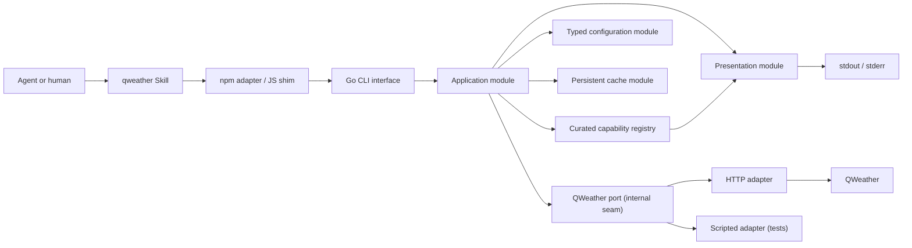
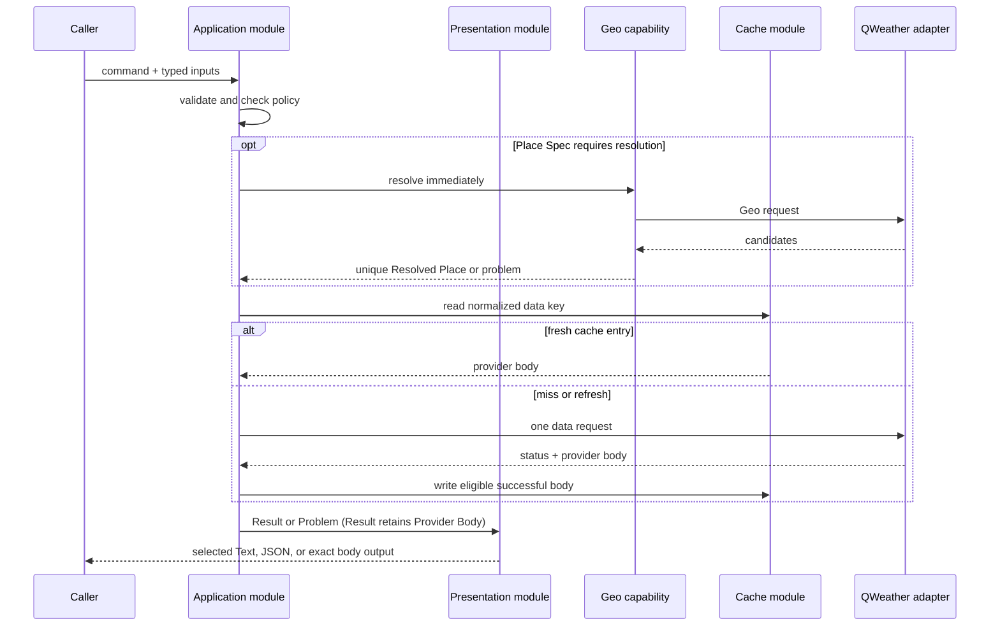

# QWeather CLI architecture

Status: accepted design

Last verified against QWeather documentation: 2026-07-22

QWeather CLI is a Go command-line tool for agents and humans to query QWeather through a stable local interface. A single `qweather` Skill teaches agents how to select commands; a small npm adapter installs and launches the platform-specific Go binary.

See also:

- [CLI contract](./cli-contract.md)
- [Runtime and distribution](./runtime-and-distribution.md)
- [Domain language](../../CONTEXT.md)
- [QWeather API documentation](https://dev.qweather.com/docs/api/)

## Goals

- Cover all 28 current QWeather GET endpoints with typed commands.
- Hide upstream path versions, parameter spelling, coordinate-order differences, authentication, and response-family differences.
- Make routine weather queries safe for agents, including deterministic place resolution and explicit readable or machine errors.
- Reduce repeated billable requests with capability-aware persistent caching while respecting GeoAPI storage restrictions.
- Keep the command contract, machine-readable catalog, Skill references, and tests derived from one curated source.
- Keep source and runtime behaviour easy for an agent to inspect and diagnose.

## Non-goals

- Calling arbitrary QWeather paths or overriding request headers.
- Exposing the five upstream endpoints already marked deprecated when the project was designed.
- Persisting or indexing Geo Data.
- Building a unified weather database or transforming all provider responses into one domain schema.
- Retrying requests, checking for updates, reporting telemetry, or downloading binaries during a weather command.
- Reproducing the complete QWeather documentation inside the repository or Skill.

## System map



The Go process is the main module. Its external interface is the complete CLI contract: command paths, flags, configuration precedence, presentation modes, machine schemas, error modes, cache behaviour, network side effects, and performance limits. The Skill and JavaScript shim do not reproduce provider transport or presentation logic.

## Deep modules

### Application module

The application module accepts parsed command input and returns a result or problem. Behind this interface it:

1. selects a Current Capability from the registry;
2. validates typed targets and parameters;
3. checks Product Gates before any network I/O;
4. resolves a Place Spec when the chosen capability requires it;
5. normalizes the provider request and cache key;
6. returns a valid cached response or invokes the QWeather port;
7. classifies `code-refer-v1`, `metadata-v1`, and `console-v1` Response Families;
8. preserves Attribution, response metadata, the Provider Body, and unknown response fields; and
9. returns a successful Result or a QWeather-owned Problem to the presentation boundary.

Deleting this module would force every caller to know GeoAPI resolution, target types, coordinate order, JWT construction, cache policy, three response families, attribution, and provider error semantics. It therefore provides depth rather than acting as a URL passthrough.

### Presentation module

The presentation module accepts the selected output mode plus an application Result or Problem. It owns the final stdout/stderr representation:

- `text` selects one embedded entry template by Capability ID, adds common context, and preserves unconsumed provider fields through a deterministic generic tree;
- `json` serializes the versioned Machine Result or Machine Problem without optional whitespace; and
- `body` writes an exact successful Provider Body for provider commands and never exposes an upstream error body.

The 28 Current Capabilities each have one manually maintained entry template. Templates may share common partials, but they are compiled into the binary, cannot be overridden, and are validated against the registry at construction. A runtime shape mismatch falls back to the complete generic Text tree rather than converting a successful provider query into an error. Presentation never changes provider request semantics or cache identity.

### Capability registry

The registry is compiled-in, project-owned Go data. Each record contains:

- stable capability ID and Cobra command path;
- summary and official documentation URL;
- target kinds and typed parameters;
- local, conditional, and mutual-exclusion validators;
- upstream method, path compiler, and response family;
- lifecycle, Billing Group, permissions, geography, and Attribution metadata;
- cache policy and evidence level; and
- a request-semantics revision.

The registry produces the Cobra leaves, `capability list/show`, generated Skill references, and table-driven coverage tests. Registry validation also proves that every Current Capability has exactly one Text entry template. It is not loaded from the network at runtime.

The official [English](https://github.com/qwd/dev-site/blob/02bb257a032c503c65924005da6ebca48d94b390/assets/openapi/qweather-apis-en.yml) and [Chinese](https://github.com/qwd/dev-site/blob/02bb257a032c503c65924005da6ebca48d94b390/assets/openapi/qweather-apis-zh.yml) OpenAPI specifications are evidence, not executable configuration. They contain equivalent path-template pairs such as `/v7/weather/{days}` and `/v7/weather/{hours}`, a `format: date` mismatch with QWeather's `yyyyMMdd` wire format, and constraints that only appear in prose. The two locales also have reviewed structural differences and must not be silently merged. CI may compare a reviewed, pinned upstream snapshot with the registry, but upstream changes require review before becoming executable. Verbatim specifications and their local examples may be shipped with the Skill for offline field and schema lookup; neither the installed CLI nor the Skill discovers commands from them at runtime.

### Configuration module

The configuration module exposes one typed interface:

```go
Load(ctx context.Context, options Options) (Effective, Diagnostics, error)
```

It strictly decodes one TOML file, selects one profile, applies fixed environment-variable rules, validates the selected authentication union, and returns an immutable effective configuration with secret-free provenance. Business modules never read environment variables or stringly typed configuration keys.

### QWeather port

QWeather is a true external dependency. The application module invokes it through an internal port. Two adapters make the seam real:

- the production HTTP adapter compiles provider paths and queries, applies exactly one authentication method, enforces HTTPS, handles gzip and response limits, and returns the unmodified body;
- the scripted test adapter records typed requests and returns deterministic responses or failures.

Provider transport details do not appear in the public CLI interface, and the scripted adapter is not exported as a public Go package.

### Cache module

The cache module owns normalized cache keys, hard TTLs, atomic file storage, expiration, and clear/status operations. It stores only eligible provider response bodies and the minimal response metadata required to rebuild a Result; it never stores rendered Text or JSON, secrets, Geo responses, Geo search text, or resolved-place mappings.

The local filesystem is a local-substitutable dependency. Tests exercise the cache through its module interface using a temporary or in-memory adapter; the cache seam remains internal to the application module.

### npm adapter and Skill

The npm adapter is a distribution adapter, not a second implementation of the client. During an explicit npm installation it selects one release asset, downloads it, verifies an npm-embedded SHA256, and installs it atomically. During normal execution it only forwards arguments, signals, stdout, stderr, and exit status to the Go binary.

The Skill is a concise agent workflow. It selects CLI commands, explicitly passes `--output text` for routine reading, requests `--output json` when exact field paths or JSON types matter, observes Product Gates, preserves Attribution, and loads detailed references only when needed. It includes a pinned, verbatim OpenAPI snapshot for provider-field lookup: English and Chinese specifications, their referenced local examples, a manifest, and upstream source and license attribution. It does not install software silently, construct provider URLs, hold credentials, or bundle the rest of the upstream documentation site.

## Request flow



A charged or sensitive Product Gate is evaluated before the optional Geo request. A `--place` invocation can therefore never spend even a Basic Geo request before a required Marine, Solar, or Account acknowledgement is present.

## Source layout

The intended layout is:

```text
cmd/qweather/                 Go entry point
internal/app/                 application module and execution flow
internal/catalog/             curated capability registry by domain
internal/config/              strict TOML loader and validation
internal/auth/                Ed25519 JWT and API-key providers
internal/place/               Place Spec and safe resolver
internal/cache/               cache policy and file adapter
internal/qweather/            port, HTTP adapter, response classifier
internal/output/              Text, JSON, and Provider Body presentation
internal/output/templates/    embedded Capability entry templates
packages/npm/                 npm installer and JavaScript shim
skills/qweather/              Skill and curated references
docs/design/                  accepted design contracts
docs/adr/                     hard-to-reverse decisions
tools/                        maintainer-only generation and contract checks
```

Package seams may be adjusted during implementation when a proposed package would expose an internal seam or create a shallow pass-through. The public CLI contract and accepted ADRs take precedence over this illustrative directory map.

## Security and privacy

- QWeather requests use the account-specific [API Host](https://dev.qweather.com/docs/configuration/api-host/) over HTTPS.
- Ed25519 JWT is the preferred [authentication](https://dev.qweather.com/docs/configuration/authentication/) method; API KEY remains a compatibility mode.
- Secrets never appear in flags, cache keys, generated references, diagnostics, debug logs, or configuration write-back.
- Redirects to a different host are rejected before credentials can be forwarded.
- Product Gates are enforced by the binary, not only by Skill instructions.
- There is no telemetry, automatic update check, or other implicit background network traffic.

## Documentation discipline

The official `qwd/dev-site` checkout lives under `.cache/qweather-dev-site-source/`, and detailed research reports live under `docs/research/`; both are maintainer evidence and remain ignored. The project does not maintain a separate page crawler or distribute the upstream site checkout.

The Skill may distribute only the reviewed, pinned English and Chinese OpenAPI specifications, the 53 local JSON examples referenced through `externalValue`, a manifest, and a source and license notice. Those copies remain unmodified upstream documentation, are updated only through an explicit review, and are never an executable registry or runtime network dependency. Other formal Skill references retain only operationally important facts, include direct official links, and record `last_verified` where facts are likely to change.

For volatile facts such as pricing, supported regions, alert types, and deprecation dates, the Skill should consult the official source when the installed catalog is insufficient. The executable registry never changes itself from live documentation.

## Accepted decisions

- [Use a Go CLI with Skill and npm adapters](../adr/0001-go-cli-with-skill-and-npm-adapters.md)
- [Own a curated capability registry](../adr/0002-own-a-curated-capability-registry.md)
- [Resolve human place names safely inside the CLI](../adr/0003-resolve-place-names-inside-the-cli.md)
- [Return a stable envelope around provider data (superseded)](../adr/0004-return-a-stable-result-envelope.md)
- [Persist capability-aware data caches but never Geo Data](../adr/0005-cache-data-but-not-geo-data.md)
- [Limit live E2E coverage to capabilities with a free allowance](../adr/0006-limit-live-e2e-coverage-for-paid-only-capabilities.md)
- [Prefer Text Views with explicit machine output](../adr/0007-prefer-text-views-with-explicit-machine-output.md)

## Primary QWeather references

- [API documentation](https://dev.qweather.com/docs/api/)
- [API Host](https://dev.qweather.com/docs/configuration/api-host/)
- [Authentication](https://dev.qweather.com/docs/configuration/authentication/)
- [Error codes](https://dev.qweather.com/docs/resource/error-code/)
- [Caching best practices](https://dev.qweather.com/docs/best-practices/cache/)
- [GeoAPI storage restrictions](https://dev.qweather.com/docs/terms/restriction/#cache-or-index-geoapi-data)
- [Pricing](https://dev.qweather.com/docs/finance/pricing/)
- [Attribution](https://dev.qweather.com/docs/terms/attribution/)
